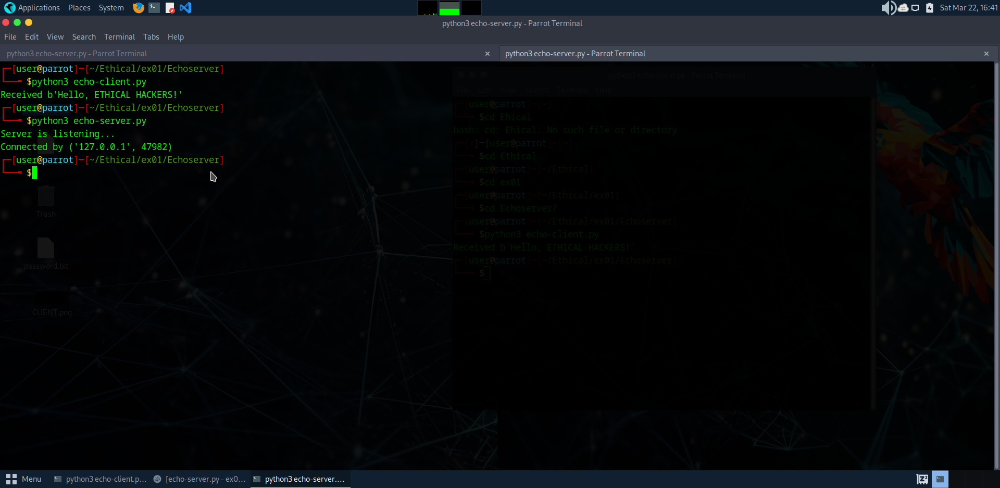
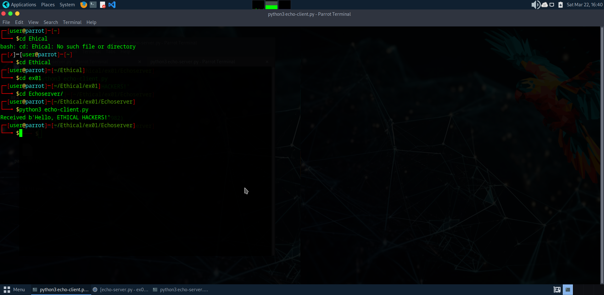

# Echoserver
Echo server and client using python socket

# AIM:

To develop a simple webserver to serve html programming pages.

## DESIGN STEPS:

### Step 1:

Design of echo server and client using python socket

### Step 2:

Implementation using Python code

### Step 3:

Testing the server and client 

## PROGRAM:
```
server.py

import socket

HOST = "127.0.0.1"
PORT = 65432

with socket.socket(socket.AF_INET, socket.SOCK_STREAM) as s:
    s.bind((HOST, PORT))
    s.listen()
    print("Server is listening...")
    conn, addr = s.accept()
    with conn:
        print(f"Connected by {addr}")
        while True:
            data = conn.recv(1024)
            if not data:
                break
            conn.sendall(data)

```
```
client.py

import socket

HOST = "127.0.0.1"
PORT = 65432

with socket.socket(socket.AF_INET, socket.SOCK_STREAM) as s:
    s.connect((HOST, PORT))
    message = b"Hello, ETHICAL HACKERS!"
    s.sendall(message)
    data = s.recv(1024)

print(f"Received {data!r}")

```

## OUTPUT:


## RESULT:
The program is executed successfully
